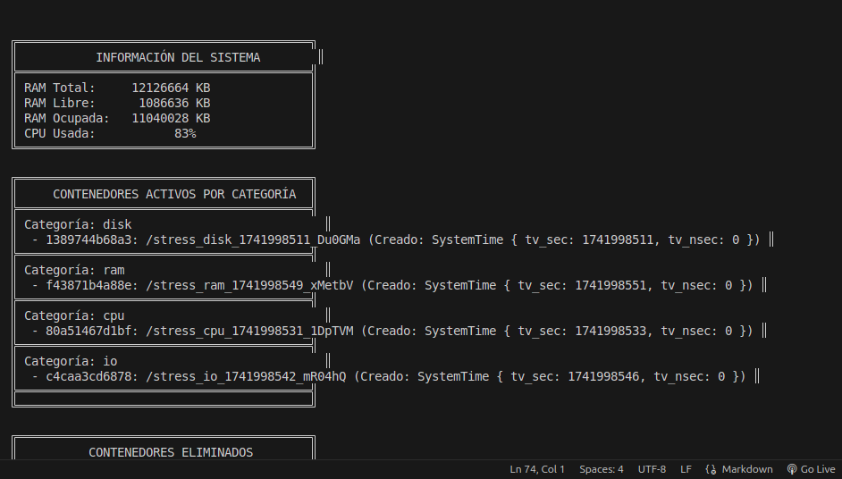
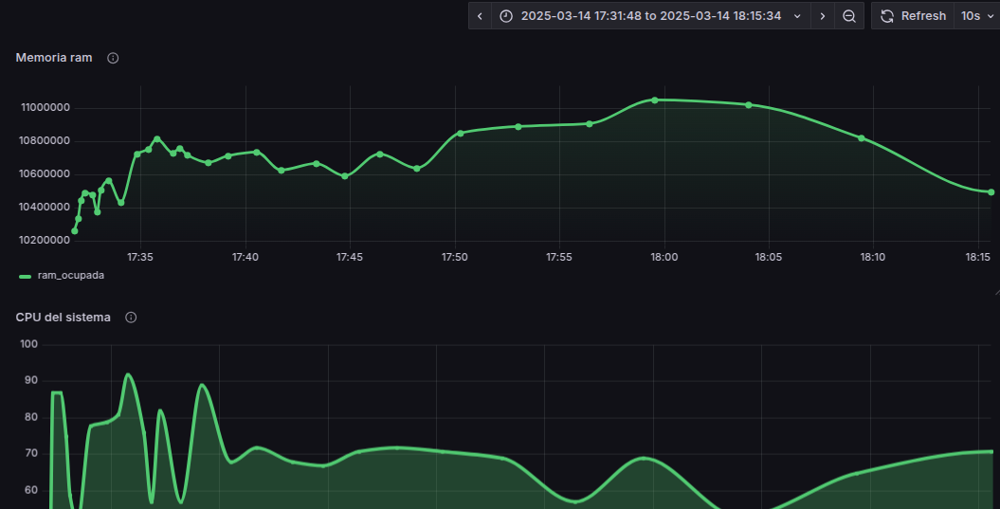
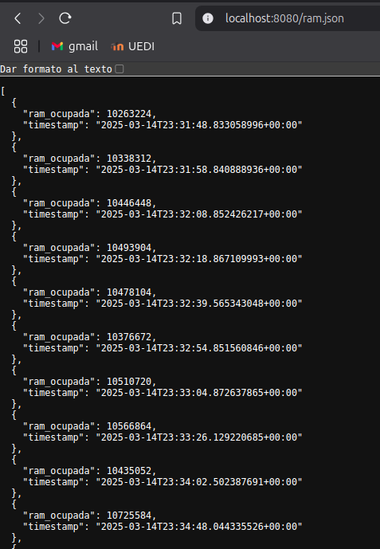
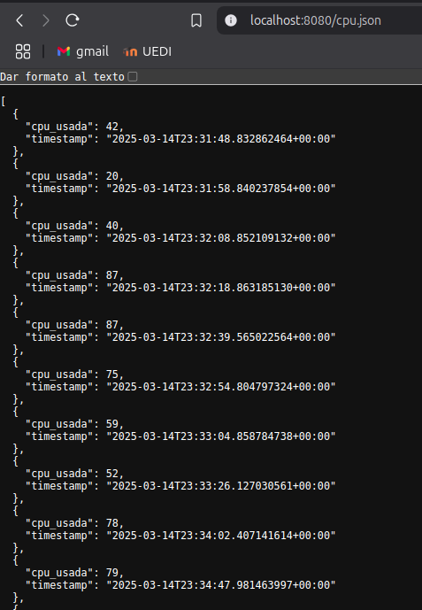
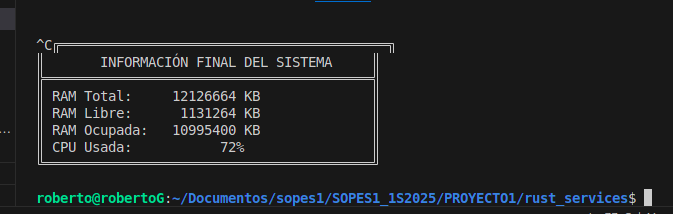
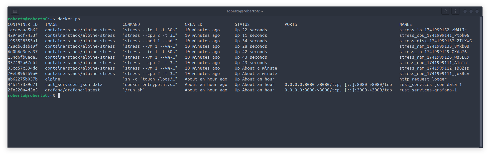

# Manual Técnico - Proyecto 1
## Roberto Miguel Garcia Santizo
- Carné : 202201724
- Curso : Sistemas operativos 1
- fecha : 14 de marzo del 2024

## 1. Introducción

El presente proyecto tiene como objetivo principal la aplicación integral de los conocimientos adquiridos en la Unidad 1 del curso, mediante el desarrollo de un gestor de contenedores. Este gestor se implementará utilizando una combinación estratégica de scripts, módulos de kernel, lenguajes de programación y Docker, la herramienta líder en la creación y gestión de contenedores. A través de este proyecto, se busca proporcionar una visión detallada de los recursos y la representación de los contenedores a nivel de procesos de Linux, así como demostrar la flexibilidad con la que estos pueden ser creados, destruidos e interconectados con otros servicios.

## 2. Objetivos

*   Conocer el Kernel de Linux mediante módulos de C.
*   Hacer uso del lenguaje de programación Rust para la gestión del sistema.
*   Comprender el funcionamiento de los contenedores usando Docker.
*   Comprender el funcionamiento de los scripts de bash para la automatización de procesos.

## 3 script
El script se realizo de una manera bastante sencilla, se puede encontrar en la carpeta de sscripts, donde se probo varias veces antes de usas su cronjob.


Se deja la forma mas facil de ejecutar un script local.
```
chmod +x nombre_script.sh
./nombre_script.sh
```

## 4 Kenrel
Para el modulo de kernel se hizo un archivo en '.c' ya que asi es mas facil acceder al kernel, se deja en especifico que comandos se uso para compilar el modulo de kernel ya que no es el habitual que se usa en trabajos en C.

Tambien debe de haber un archivo llamado 'Markefile' que es bastante de hacer. 
* Nota: el archivo en markefile debe de llevar el mismo nombre que el archivo en c
```
make
sudo insmod nombreArchivo.ko
```

## 5 Rust
Para el modulo de rust fue mas complejo 
Se empezo a trabajar todo por separado ya que algunas cosas no compilaban de manera sencilla

El archivo de rust se encuentra en la carpeta llamada `rust_services`

A pesar que hay varios archivos no se trabajo como habitual se hace, con clases, se trabajo todo absolutamente todo en el archivo main ya que rust no maneja de la mejora manera clases pero si es posible

Para compilar en rust son los siguientes comandos
```
cargo new nombre_archivo
cd nombre_archivo
cargo build 
cargo run
```

Esos son lo comandos escenciales para compilar en rust

## 6 Graficas
En graficas se trabajo con `Grafana` fue mas sencillo y compilo de menor manera 

Pero para trabajar con grafana y rust se trabajo con `docker-compose` para levantar los servidores de la mejor manera

```
Puerto 8080 ----> para las graficas
Puerto 5000 ----> Para el contenedor principal de los logs
Puerto 3000 ---->  Para el contendor de grafana
```

Para actualizar los json en tiempo real se uso volume en docker para manejar los archivos en local y se actualicen con docker y asi graficar en tiempo real

Y para hacer la comunicacion con los json y grafana se uso con network para que ambos esten en la misma linea

Ya en `Localhost:3000` se ingreso con el password y user admin por facilidad no se cambio y para hacer la conexion se uso `http://172.19.0.3:8080/cpu.json` y `http://172.19.0.3:8080/ram.json`

## 7 Pruebas





